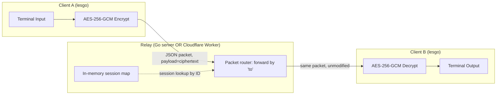
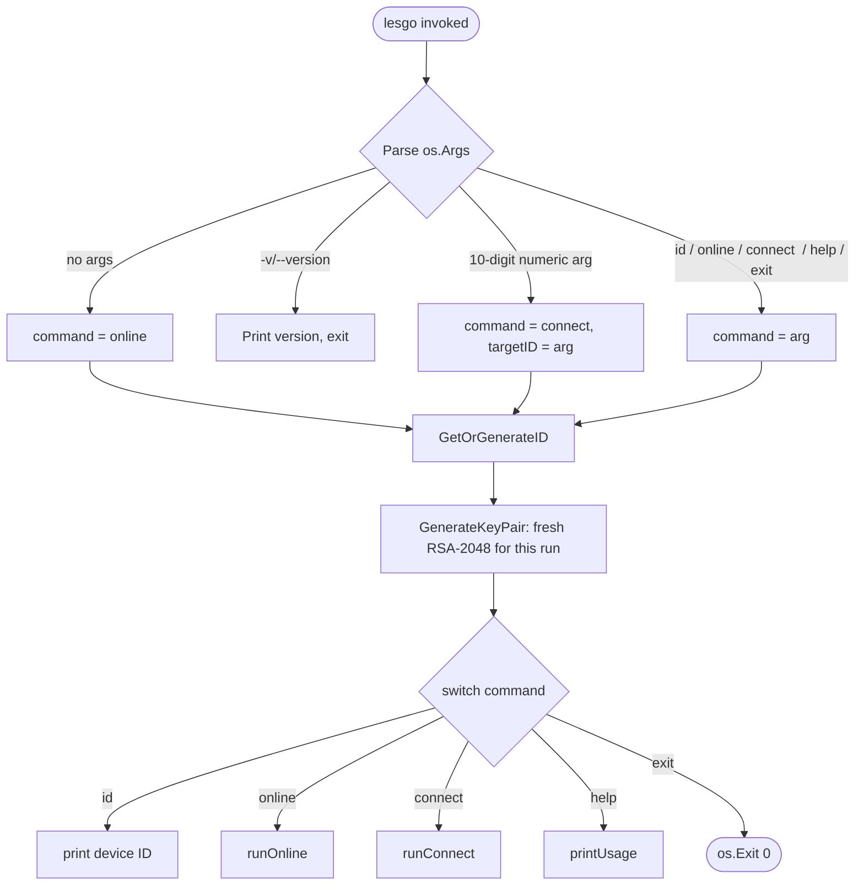
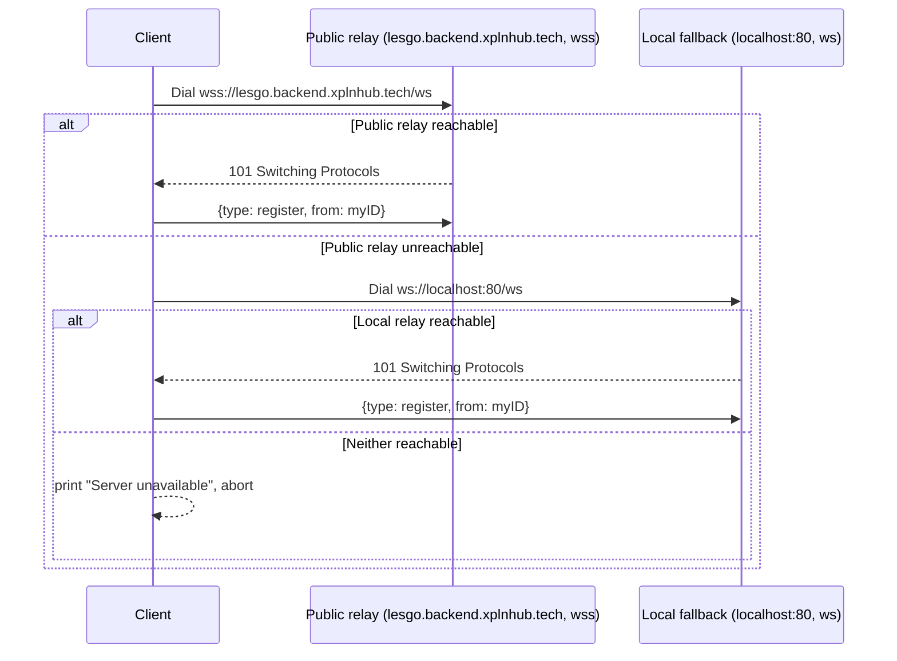
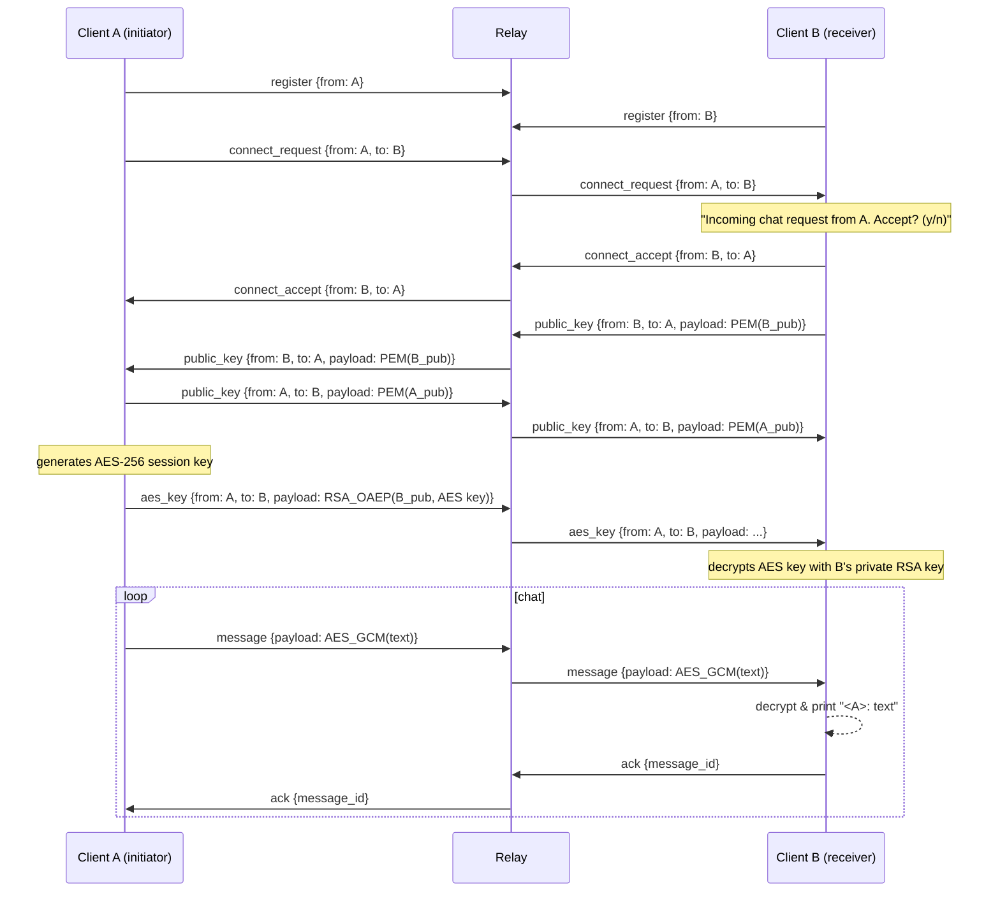
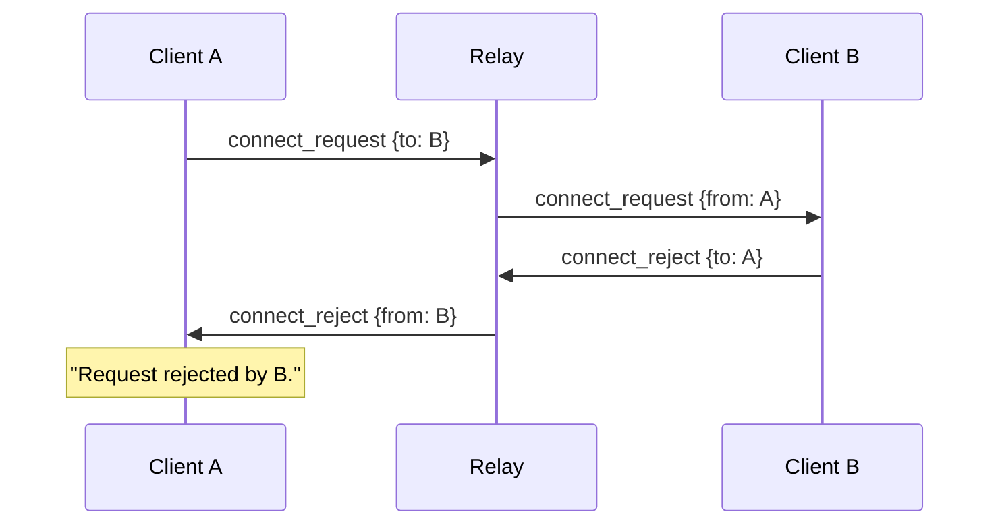
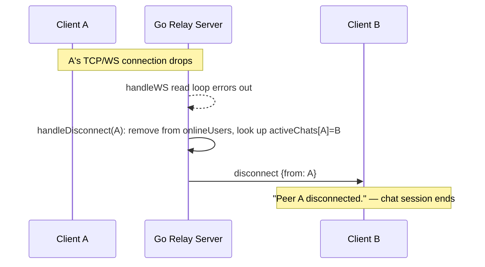
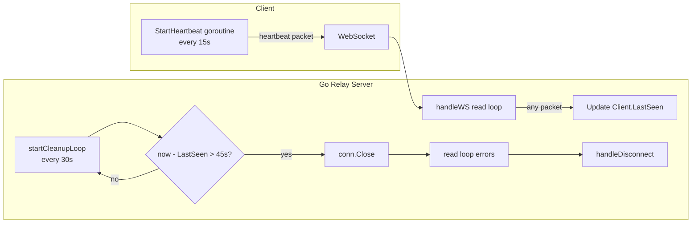
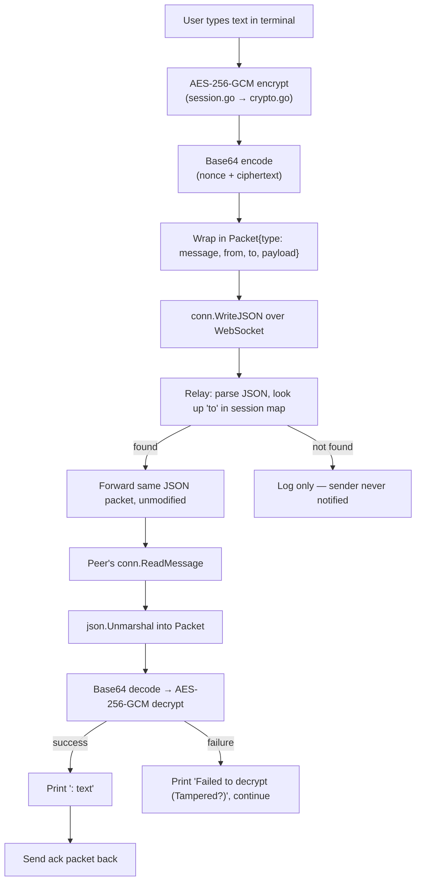
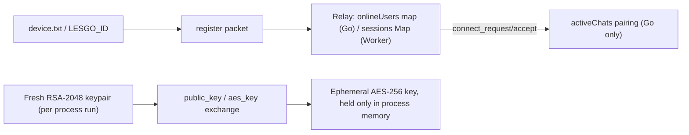

# Les'Go — Project Understanding

> Single source of truth for what this project is, how it actually works today, what's broken,
> what's undocumented, and what to do next. Written from a direct read of the repository as of
> 2026-08-26 (commit `9a93fea`, tag `v1.2.0`), not from README claims.

---

## 1. Project Overview

### What it is
Les'Go is a CLI, peer-to-peer-feeling chat tool written in Go. Two people each run a small
binary (`lesgo`), get a random 10-digit device ID, and use that ID to request a chat with each
other through a relay. Once the peer accepts, messages are end-to-end encrypted
(RSA-2048 for key exchange, AES-256-GCM for the actual messages) and the relay only ever sees
ciphertext.

### Problem it solves
Ad-hoc, account-free, terminal-native private messaging: no sign-up, no phone number, no stored
message history, works between two strangers who just exchange a 10-digit number out of band.

### Why it exists
Positioned as "WhatsApp for the terminal" — a minimal, privacy-first alternative for developers
who live in a terminal and don't want a heavyweight chat app or an account-based service for a
quick encrypted conversation.

### Main goals / expected outcome
- Zero-knowledge relay: server/relay never has plaintext or private keys.
- Zero persistence: no database, no message history, in-memory session state only.
- Frictionless UX: `lesgo` to go online, `lesgo <id>` to connect — nothing else required.
- Cross-platform distribution (Homebrew, Scoop, direct binaries, `go install`, Docker).

### Current status
This is a **small, working prototype with a real release pipeline**, not a "production-ready"
system in the sense the README claims. The core one-to-one encrypted chat flow works end-to-end.
But the project currently ships **two different, drifting relay implementations** (a Go server
and a Cloudflare Worker) and the one actually serving production traffic is the *less complete*
one. See §7 and §10 for details — this is the single most important thing to understand about
the project's real state.

### Working vs. incomplete

| Area | Status |
|---|---|
| Device ID generation & persistence | ✅ Working |
| RSA-2048 key generation, PEM encode/decode | ✅ Working |
| RSA-OAEP key wrapping of AES key | ✅ Working |
| AES-256-GCM message encryption/decryption | ✅ Working |
| Connect / accept / reject handshake (Go client ↔ Go server) | ✅ Working |
| Heartbeat + dead-session cleanup | ⚠️ Working on Go server only, **inert on production (Cloudflare) backend** |
| Peer-disconnect notification | ⚠️ Working on Go server only, **missing on production backend** |
| Message delivery ACK (`ack` packet) | ⚠️ Sent by client, never read/used by either client or server (see §7) |
| Browser web client (embedded in `worker.js`) | ⚠️ Present, functional-looking, entirely undocumented, protocol compatibility with the Go CLI unverified |
| Sender-identity validation | ❌ Missing — any connected client can forge the `from` field on any packet |
| Automated tests | ❌ None exist anywhere in the repo |
| CI/CD for the Cloudflare Worker | ❌ Missing — worker is deployed manually, out of band from git tags |
| Docs matching reality | ❌ `docs/connection.md` describes an architecture (Nginx, EC2/Droplet, Redis multi-relay) that was never built; real production is Cloudflare Workers + Durable Objects, documented nowhere |

---

## 2. Architecture Overview

### Major components

1. **CLI Client** (`client/`) — Go binary `lesgo`. Generates/loads a device ID, generates an
   ephemeral RSA-2048 keypair per run, connects to a relay over WebSocket, drives the CLI command
   the user typed, and runs the terminal chat loop.
2. **Go Relay Server** (`server/main.go`) — a standalone WebSocket relay. Keeps an in-memory map
   of online users and active chat pairings, forwards packets by `to` field, runs a heartbeat
   timeout cleanup loop. Distributed as a Docker image and cross-platform binary via GoReleaser.
3. **Cloudflare Worker Relay** (`worker.js` + `wrangler.toml`) — a **second, independent**
   implementation of the same relay concept, built on a Cloudflare Durable Object, deployed at
   `lesgo.backend.xplnhub.tech`. **This is the actual default backend the client connects to.**
   It also serves an embedded browser-based chat client (HTML/CSS/JS) at `/`.
4. **Shared Protocol** (`protocol/protocol.go`) — the packet struct and type constants used by
   the Go client and Go server. The Cloudflare Worker re-implements a compatible-looking subset
   of this protocol independently in JavaScript (not by importing anything — there's no shared
   schema, so the two can silently drift).

### Communication

- Transport: WebSocket (`gorilla/websocket` in Go; native WebSocket API in the Worker/browser).
- Message format: JSON packets — `{type, from, to, payload, timestamp, message_id}`.
- The relay is a **pure router**: it looks at `packet.to`, finds that user's live connection, and
  forwards the raw packet verbatim. It never inspects or needs to understand `payload` (it's
  opaque Base64 ciphertext from the relay's point of view).
- Encryption is entirely client-side: RSA-2048/OAEP wraps a per-session AES-256 key; AES-256-GCM
  encrypts every chat message. The relay only ever touches ciphertext.

### Data flow (conceptual)



### External dependencies

- `github.com/gorilla/websocket` — the only third-party Go dependency (per `go.mod`).
- Cloudflare Workers + Durable Objects runtime (for the production relay).
- GitHub Actions, GoReleaser, GHCR (container registry), Homebrew tap, Scoop bucket — release
  infrastructure, not runtime dependencies.

### Important design decisions (and their trade-offs)

- **In-memory only, no database.** Simple, genuinely zero-persistence, but means the relay is a
  single point of failure for live sessions — a restart drops every online user and active chat.
- **Relay never decrypts.** Correctly designed E2EE boundary: keys are generated client-side and
  never leave the device unencrypted.
- **10-digit numeric IDs, no accounts.** Very low friction, but also no verification of identity
  — anyone who has your ID can request a chat with you, and (per §10) can also currently spoof
  being you to a third party.
- **Two relay implementations for one protocol.** This is the project's central architectural
  problem, not a strength — see §10.
- **Single global Durable Object (`idFromName("global-relay")`).** Cloudflare Durable Objects are
  single-threaded and pinned to one location; using exactly one instance for *all* users worldwide
  means the Worker deployment does not horizontally scale and is a global single point of failure
  for the "production" backend, directly contradicting the multi-relay scaling story in
  `docs/connection.md`.

---

## 3. Codebase Structure

```text
Les-Go/
├── client/                 # The `lesgo` CLI binary's source
│   ├── main.go              # Entry point: arg parsing, command dispatch, server connection
│   ├── chat.go               # Interactive chat loop + incoming-request handshake handler
│   ├── crypto.go              # RSA-2048 keygen/PEM, RSA-OAEP wrap, AES-256-GCM encrypt/decrypt
│   ├── device.go               # Device ID: env override → device.txt → generate+persist
│   ├── session.go                # ChatSession: peer ID + AES key + Encrypt/Decrypt wrappers
│   └── heartbeat.go               # Background goroutine sending `heartbeat` every 15s
├── server/                 # The Go relay server (self-hostable / Docker option)
│   ├── main.go               # WebSocket upgrade, packet routing, cleanup loop, /health
│   ├── Dockerfile             # Multi-stage build from source (local `docker build`)
│   └── Dockerfile.goreleaser   # Slim image that copies a GoReleaser-built binary in (CI path)
├── protocol/
│   └── protocol.go          # Shared Packet struct + type constants (Go side only)
├── worker.js                # Cloudflare Worker: second relay implementation (Durable Object)
│                             #   + an entirely separate embedded browser chat client (HTML/JS)
├── wrangler.toml             # Cloudflare deployment config: binds `lesgo.backend.xplnhub.tech`
├── docs/
│   ├── product.md            # Product requirements — matches the Go client/server fairly well
│   ├── protocol.md            # "Frozen" packet protocol spec — matches Go side; not the Worker
│   ├── connection.md           # Describes an EC2/Nginx/Redis production architecture that was
│   │                            #   never built; real prod is the Cloudflare Worker (see §10)
│   ├── context.md              # AI-oriented project summary, reasonably accurate for the Go side
│   └── SETUP.md                # Multi-device setup instructions (public relay + LAN)
├── .github/workflows/
│   ├── go.yml                 # CI: build client+server, `go test ./...` (no tests exist)
│   └── release.yml             # On `v*` tag: GoReleaser → binaries, Docker images, Homebrew/Scoop
├── .goreleaser.yaml           # Cross-platform build/package/publish config
├── device.txt                # ⚠️ A real generated device ID, committed to git (see §7, §10)
├── go.mod / go.sum            # Module = github.com/XplnHUB/Les-Go, Go 1.24, one dependency
├── README.md                 # Install instructions + feature overview; references a
│                              #   non-existent `todo.md` and an outdated project-structure tree
└── LICENSE                   # MIT
```

### Why each piece exists / how it connects

- **`client/main.go`** is the only place that knows about CLI commands (`id`, `online`,
  `connect`, `exit`, `help`, version flags) and the "bare 10-digit arg = connect" shortcut. It
  owns the WebSocket dial logic, including the public-relay → `localhost:80` fallback.
- **`client/chat.go`** owns both directions of the 4-step handshake (`HandleIncomingRequest` for
  the receiver, and the `connect`-side logic embedded in `main.go`'s `runConnect`) and the actual
  message loop once a session is established. It's the busiest file and the one most tangled with
  `main.go` — the handshake logic is split across two files instead of one.
- **`client/crypto.go`** is pure crypto, no I/O beyond key material — clean separation, easy to
  unit test (though nothing currently does).
- **`client/device.go`** is the identity layer. Three-tier resolution (env → file → generate) is
  intentional, to let multiple clients run side-by-side on one machine for testing
  (`LESGO_ID=...`).
- **`server/main.go`** is a monolithic relay: HTTP upgrade, routing, cleanup, and health check all
  in one file. Small enough that this isn't yet a real problem, but it's the piece that would need
  to be split up first if the server grew (e.g., Redis-backed session store per `connection.md`'s
  future-scaling section).
- **`protocol/protocol.go`** exists specifically so client and Go-server agree on wire format by
  sharing a Go type. **The Cloudflare Worker does not import this — it hand-rolls its own subset
  in JS**, which is the root cause of the drift documented in §7/§10.
- **`worker.js`** is really two products glued into one file: (a) a relay compatible in spirit
  with `protocol/protocol.go`, and (b) a full browser chat UI + client-side crypto
  implementation using the Web Crypto API. Neither is referenced anywhere in README or `docs/`.
- **`device.txt`** should never have been a tracked file — it's regenerated per machine, and
  putting it in `.gitignore` (which was done) doesn't remove it from git history/tracking once
  committed. It currently sits in the repo root with a real 10-digit ID in it.

---

## 4. Complete Workflow

### 4.1 Application startup (client)



Notes:
- `GetOrGenerateID` reads `device.txt` (or `LESGO_ID` env var) — this is the *only* persisted
  state on the client side.
- The RSA keypair is regenerated **every run**, never persisted. This is a deliberate ephemeral-
  identity choice (documented as "temporary" in the README) but means device ID (long-lived) and
  crypto identity (per-session) are decoupled — there's no way to verify "this is really device
  1234567890's key" across sessions.

### 4.2 Connection to relay



`LESGO_SERVER` env var overrides the default entirely (used for LAN setups per `docs/SETUP.md`).

### 4.3 Core business workflow — connect handshake + chat

This is the heart of the product. Steps 1–7 below match `docs/protocol.md`'s frozen spec and the
actual Go client/server code (verified against `client/main.go`, `client/chat.go`,
`server/main.go`).



Important real-code detail: **only the initiator (A) ever generates the AES session key** in the
Go client/server path. The receiver (B) never generates or sends an `aes_key` packet — it only
decrypts the one it receives. This is asymmetric by design and matches `docs/protocol.md`.

### 4.4 Rejection / disconnect paths





**⚠️ This disconnect notification only happens on the Go relay server.** On the production
Cloudflare Worker relay, the equivalent `close` event handler only deletes the session from its
local map — it never sends a `disconnect` packet to the peer (see `worker.js`, the
`addEventListener("close", ...)` block). A user chatting through production today will simply see
their peer go silent with no notification, rather than the documented "Peer X disconnected"
message. This is a real functional gap between docs/spec and the live backend — tracked in §10.

### 4.5 Heartbeat / cleanup (Go server only)



On the Cloudflare Worker, `heartbeat` packets are received and **silently discarded**
(`if (packet.type === "heartbeat") return;`) — there is no `LastSeen` concept and no timeout
sweep at all. Dead-session cleanup on production relies entirely on the platform's own WebSocket
`close`/error events firing, which is less deterministic than the Go server's explicit timeout.

### 4.6 Error handling

- **Client-side:** almost every failure path prints a message and returns/breaks out of the
  current loop; there is no retry or reconnect logic anywhere in the client. A dropped connection
  mid-chat ends the session; the user must re-run `lesgo`.
- **Server-side (Go):** malformed JSON is logged and the packet is dropped (`continue`); a
  forward failure (`WriteJSON` error) is logged but not surfaced to the sender.
- **Server-side (Worker):** wraps the whole message handler in `try/catch` and logs to
  `console.error`; same drop-and-continue behavior, no error surfaced to sender.
- **No error/failure packet type exists in the protocol** — e.g., "target offline" is only ever
  logged server-side (`log.Printf("Target %s offline...")`); the *sender* is never told their
  message or connect request silently failed to deliver. On the client, this shows up as: the
  initiator sees "Sending chat request to..." and then nothing ever happens, with no timeout or
  error message.

### 4.7 Monitoring / logging

- Go server logs to stdout via the standard `log` package: registrations, heartbeats, forwarding
  failures, cleanup events. No structured logging, no log levels, no external sink.
- `/health` endpoint exists on the Go server (`{"status":"ok","time":...}`) but is not wired into
  any deployment health check, uptime monitor, or documentation.
- Worker uses `console.log`/`console.error`, visible only in Cloudflare's dashboard/`wrangler tail`
  — not integrated with anything either.
- **No metrics** (connection counts, message throughput, error rates) anywhere in the system.

---

## 5. Detailed Component Explanation

### 5.1 `client/main.go` — CLI entry point
- **Purpose:** parse the command line, resolve identity, dispatch to the right flow.
- **Inputs:** `os.Args`, `LESGO_ID` (via `device.go`), `LESGO_SERVER` env var.
- **Outputs:** stdout messages; a live WebSocket session handed off to `chat.go`/`heartbeat.go`.
- **Depends on:** `protocol`, `gorilla/websocket`, `device.go`, `crypto.go`, `chat.go`,
  `heartbeat.go` (same package, no import needed).
- **Key functions:** `main`, `runOnline`, `runConnect`, `connectToServer`, `registerAtServer`.
- **Failure cases:** relay unreachable (both public and local fallback) → prints message, returns
  `nil` conn, caller functions bail; invalid/short target ID → rejected before dialing.
- **Interacts with:** relay (WebSocket), `chat.go` (hands off the established session).

### 5.2 `client/chat.go` — handshake + chat loop
- **Purpose:** run the receiver-side handshake (`HandleIncomingRequest`) and the actual message
  send/receive loop (`StartChatSession`) for both sides once a session exists.
- **Inputs:** decrypted terminal text (outbound), incoming `message`/`disconnect` packets
  (inbound).
- **Outputs:** encrypted `message` packets sent to the relay; `<peerID>: text` printed to stdout;
  `ack` packets sent for every received message.
- **Dependencies:** `session.go` (`ChatSession.Encrypt/Decrypt`), `crypto.go` indirectly,
  `protocol`.
- **Failure cases:** decrypt failure → prints "Failed to decrypt message... (Tampered?)" and
  continues (does not crash or drop the session) — this is a reasonable, tolerant failure mode.
  WebSocket read error → prints "Disconnected from server" and exits the read goroutine, but
  **the stdin-reading loop keeps blocking on `scanner.Scan()`** until the user presses Enter —
  minor UX rough edge (see §10).
- **Interacts with:** relay (send/receive), user (stdin/stdout).

### 5.3 `client/crypto.go` — cryptography
- **Purpose:** all key generation, wrapping, and message encryption in one place.
- **Inputs:** plaintext bytes / AES key bytes / RSA keys.
- **Outputs:** Base64 strings suitable for the `payload` field.
- **Key functions:** `GenerateKeyPair` (RSA-2048), `PublicKeyToPEM`/`PEMToPublicKey`,
  `EncryptWithRSA`/`DecryptWithRSA` (RSA-OAEP/SHA-256), `GenerateAESKey`,
  `EncryptAES`/`DecryptAES` (AES-256-GCM, random 12-byte nonce prepended to ciphertext).
- **Failure cases:** malformed PEM/base64/ciphertext-too-short all return errors, handled by
  callers.
- **Minor inconsistency:** `PublicKeyToPEM` labels the PEM block `"RSA PUBLIC KEY"` (the
  conventional label for PKCS#1) but encodes it with `x509.MarshalPKIXPublicKey` (PKIX/SPKI
  format). Functionally harmless since only this codebase's own `PEMToPublicKey` ever parses it
  (and correctly expects PKIX), but the label would mislead any external tool (e.g. `openssl`)
  inspecting the PEM.

### 5.4 `client/device.go` — identity
- **Purpose:** resolve a stable 10-digit device ID.
- **Resolution order:** `LESGO_ID` env → `device.txt` → freshly generated + persisted.
- **Failure cases:** file write failure returns an error, which `main.go` treats as fatal
  (`log.Fatalf`).
- Uses `math/rand` seeded by `time.Now().UnixNano()` — fine for a non-cryptographic identifier,
  but note this ID is **not itself a security credential**, just an address.

### 5.5 `client/session.go` — session state
- **Purpose:** small value object binding a peer ID to its negotiated AES key, with
  `Encrypt`/`Decrypt` convenience methods. No independent failure modes beyond `crypto.go`'s.

### 5.6 `client/heartbeat.go` — keep-alive
- **Purpose:** send a `heartbeat` packet every 15 seconds until the passed `context.Context` is
  cancelled or the write fails.
- **Interacts with:** the Go relay server's `LastSeen` tracking (meaningful) and the Cloudflare
  Worker (currently a no-op on the receiving end).

### 5.7 `server/main.go` — Go relay server
- **Purpose:** WebSocket relay + in-memory session/presence registry + dead-session cleanup +
  health endpoint.
- **Inputs:** WebSocket connections on `/ws`, HTTP GET on `/health`.
- **Outputs:** forwarded packets to the addressed peer; `disconnect` notifications; health JSON.
- **State:** two `sync.Map`s — `onlineUsers` (ID → `*Client`) and `activeChats` (ID → peer ID),
  safe for concurrent access without an external lock (though each `*Client` also has its own
  `sync.Mutex` guarding `LastSeen` and writes to its own connection).
- **Key functions:** `handleWS` (per-connection read loop + routing switch), `handleDisconnect`,
  `startCleanupLoop` (30s tick, 45s dead-session threshold), `handleHealth`.
- **Failure cases:** target offline → logged only, sender not informed (§4.6); malformed JSON →
  dropped.
- **Design note:** `CheckOrigin` on the upgrader unconditionally returns `true` — any website
  could open a WebSocket to this relay from a browser context. Given there's no cookie/session
  auth involved, the practical CSRF-style risk is low, but it does mean there's no origin
  allow-listing at all, which is worth tightening if the relay is ever given any privileged
  capability.

### 5.8 `worker.js` — Cloudflare Worker relay + embedded web client
This file does two unrelated jobs:

**(a) Relay (`RelayServer` Durable Object class):**
- **Purpose:** same conceptual job as `server/main.go`, reimplemented independently in JS.
- **State:** a single `Map` (`this.sessions`) inside **one** Durable Object instance shared by
  literally everyone (`env.RELAY.idFromName("global-relay")` in the `fetch` handler — a hardcoded
  constant name, not per-user).
- **What it does:** on `register`, stores `myID → server` websocket; on any other non-heartbeat
  packet, looks up `this.sessions.get(packet.to)` and forwards verbatim; on socket `close`,
  deletes the session.
- **What it's missing relative to the Go server:** no `LastSeen`/timeout cleanup loop, no
  `activeChats` bookkeeping, **no disconnect notification to the peer on close**, no `/health`
  equivalent exposed distinctly from the root route's inline JSON.
- **Failure cases:** any thrown error inside the message handler is caught and logged; the packet
  is simply dropped.

**(b) Embedded browser client (the `html`/`js` template strings):**
- **Purpose:** a self-contained single-page chat UI, served at `/` with its JS at `/app.js`
  (with `WS_HOST` template-substituted to the actual request host).
- **Crypto:** uses the Web Crypto API — RSA-OAEP 2048 + AES-GCM 256 — functionally analogous to
  the Go client's `crypto.go`, but it's an **entirely separate implementation** with its own
  subtle behavior: on receiving a `public_key` packet, if no session exists yet for that peer, it
  **generates its own AES session key too** (not just the connect-initiator). Combined with the
  Go client's initiator-only AES generation, mixed CLI↔browser sessions have **unverified**
  compatibility — nothing in the repo tests or documents whether a CLI client can actually
  complete a handshake with the browser client, or which side's `aes_key` "wins."
- **Not documented anywhere** — no README section, no `docs/` entry, no link. A user reading the
  docs would have no idea this web client exists or that visiting `lesgo.backend.xplnhub.tech`
  in a browser gives them a full chat UI.

### 5.9 `protocol/protocol.go` — shared wire format (Go side)
- **Purpose:** single source of truth for packet shape and type constants, imported by both
  `client` and `server` packages.
- **Not consumed by `worker.js`** at all — the Worker's protocol understanding is a hand-copied,
  partial reimplementation with no shared schema or codegen, which is the structural reason the
  two relays have drifted (§4.4, §5.8).

---

## 6. Data Flow

### 6.1 Message data flow (happy path)



- **Input:** terminal keystrokes.
- **Processing:** entirely client-side crypto; the relay only ever moves JSON blobs.
- **Storage:** none — no message is ever written to disk or a database anywhere in this system,
  by any component. The only durable client-side artifact is `device.txt` (the ID, not messages).
- **Retrieval:** none — there is no history; closing a client loses the conversation.
- **Output:** printed to the peer's terminal (or rendered in the browser client's message list).
- **Error/failure paths:** decrypt failure is tolerated and shown to the user; relay-level
  delivery failure (peer offline) is silent and unrecoverable from the sender's perspective.

### 6.2 Identity/session data flow



Nothing here is persisted server-side; everything lives in process memory (`sync.Map` in Go, a
plain `Map` per Durable Object instance in the Worker) and disappears on disconnect/restart.

---

## 7. Current Implementation — what's real vs. what's claimed

### What is actually implemented and working
- Full RSA-2048 + AES-256-GCM E2EE pipeline, verified by reading `crypto.go` line by line — this
  part is solid and matches `docs/protocol.md` exactly.
- The Go client ↔ Go server handshake and chat loop, including reject, heartbeat, and
  timeout-based cleanup with peer disconnect notification.
- A real, working cross-platform release pipeline: tag push → GoReleaser → binaries for
  linux/darwin/windows × amd64/arm64, multi-arch Docker images to GHCR, Homebrew tap, Scoop
  bucket. This is genuinely more mature than most small CLI projects.
- Environment-variable based multi-client testing on one machine (`LESGO_ID`) and LAN setups
  (`LESGO_SERVER`) — both work as documented.

### What was tried and changed (from git history)
Reading the commit log (`feat: Overhaul connection architecture and protocol (AES-256-GCM E2EE,
secure handshake, heartbeat cleanup)`, then several commits retargeting Cloudflare) shows the
project evolved from a self-hosted-only relay toward a Cloudflare-hosted production backend. The
Go server and its Docker/GoReleaser packaging were **not removed** when the Cloudflare Worker was
introduced — they were kept as a self-host/local-dev option, but the Worker was built as a
**parallel, independent reimplementation** rather than, say, compiling the same Go relay to WASM
or keeping a single canonical protocol implementation. That decision is the direct cause of every
Go-vs-Worker discrepancy in this document.

### What is only partially implemented
- **`ack` packets:** the CLI client sends one after successfully decrypting a `message`
  (`chat.go`), and the protocol/type constant exists on both relays, but **nothing on the sending
  side ever reads or reacts to an incoming `ack`** (`main.go`/`chat.go` never switches on
  `protocol.TypeACK`) . So today it's dead weight: sent, forwarded, received, and silently
  ignored. It is *not* used for delivery confirmation, retries, or UI feedback despite existing
  for exactly that purpose per `docs/protocol.md`.
- **Disconnect notification:** implemented and correct on the Go server; **absent** on the
  Cloudflare Worker relay that production actually uses (§4.4).
- **Heartbeat-based liveness:** implemented on the Go server; **inert** on the Worker (packets
  received and discarded, no timeout logic at all).

### What is missing entirely
- Sender-identity verification: the relay (either implementation) trusts `packet.From` at face
  value and never checks it against the identity that was actually `register`-ed on that specific
  WebSocket connection. A connected client can put *any* ID in `from` on `connect_request`,
  `message`, etc. There is no cryptographic binding between "who registered this socket" and "who
  this packet claims to be from" at the relay layer (the E2EE payload itself is still safe — an
  attacker without the right private key still can't decrypt real messages — but presence,
  requests, and social-engineering-style spoofing ("message from a friend's ID") are possible).
- Automated tests of any kind (see §9).
- Rate limiting / abuse protection on either relay.
- Any form of message queuing for offline peers — if the target isn't online at delivery time,
  the packet is simply dropped.
- CI/CD for the Cloudflare Worker (no `wrangler deploy` step in `.github/workflows/`).

### Known limitations / technical debt
1. **Two relay implementations, one canonical protocol, no shared schema** — the core structural
   debt of this project (§10 has the full writeup).
2. **`device.txt` is a tracked, committed file** containing a real generated ID
   (`7621330789` as of this read) — should never have been committed; `.gitignore` was added
   *after* it was already tracked, so ignoring it now does nothing (git still tracks changes to
   already-tracked files regardless of `.gitignore`).
3. **README references `todo.md`**, which does not exist anywhere in the repo — stale
   documentation.
4. **`docs/connection.md`** describes a Nginx/EC2/Redis/multi-relay production architecture that
   was never built and doesn't match `worker.js`/`wrangler.toml` at all — actively misleading if
   read as current-state documentation rather than an old design doc.
5. **No reconnect/retry logic** anywhere in the client — any WebSocket drop ends the session and
   requires a full manual restart.
6. **Minor UX bug:** in `StartChatSession`, when the read goroutine detects a disconnect it
   returns, but the stdin-scanning loop in the main goroutine keeps blocking until the user
   presses Enter once more before the function actually returns "Exiting chat...". Not a crash,
   just a rough edge.
7. **PEM block mislabeling** in `PublicKeyToPEM` (§5.3) — cosmetic today, could bite if any
   external tool ever needs to parse these keys.

---

## 8. Configuration & Environment

### Environment variables

| Variable | Used by | Purpose | Default |
|---|---|---|---|
| `LESGO_SERVER` | client | Override relay address (`host:port` or bare host) | `lesgo.backend.xplnhub.tech` (wss) |
| `LESGO_ID` | client | Force a specific 10-digit device ID (multi-client testing) | none — falls back to `device.txt` |
| `PORT` | Go server | HTTP/WS listen port | `80` |

No `.env` file mechanism exists in the code (`.gitignore` lists `.env` but nothing reads one);
these are plain OS environment variables set before running the binary.

### Configuration files
- `wrangler.toml` — Cloudflare Worker config: worker name `lesgo`, entry `worker.js`, one Durable
  Object binding (`RELAY` → `RelayServer`), custom domain route
  `lesgo.backend.xplnhub.tech`, SQLite-backed Durable Object migration (`new_sqlite_classes`).
- `.goreleaser.yaml` — build matrix, archive naming, Homebrew tap (`XplnHUB/homebrew-tap`) and
  Scoop bucket (`XplnHUB/scoop-bucket`) publishing, multi-arch Docker image build/push to
  `ghcr.io/xplnhub/lesgo-server`.
- `go.mod` — module `github.com/XplnHUB/Les-Go`, Go 1.24.2, single dependency
  `gorilla/websocket v1.5.3`.

### Required services
- To **use** the client against the public relay: nothing beyond network access to
  `lesgo.backend.xplnhub.tech` (Cloudflare-hosted, always-on).
- To **self-host**: Go 1.20+ (README) / 1.24 toolchain (`go.mod`/CI actually require 1.24), or
  Docker, to run `server/main.go`.
- To **redeploy the Cloudflare Worker**: a Cloudflare account with Workers + Durable Objects
  enabled, and the Wrangler CLI, run **manually** — there is no automation for this in the repo.

### Local development setup
```bash
git clone https://github.com/XplnHUB/Les-Go.git
cd Les-Go
go mod download
go run ./client/*.go online          # or: go build -o lesgo ./client && ./lesgo
PORT=8080 go run ./server/main.go     # optional: run your own relay locally
LESGO_SERVER=localhost:8080 go run ./client/*.go online   # point client at it
```

### Production requirements
- Public backend: Cloudflare Worker, already deployed at `lesgo.backend.xplnhub.tech` (per
  `wrangler.toml`'s route) — **redeploying it is a manual, undocumented, out-of-band process**,
  which is a real operational gap (§10).
- Self-hosted alternative: the published Docker image
  (`ghcr.io/xplnhub/lesgo-server:latest`) or a GoReleaser binary, exposed on port 80/8080 behind
  whatever TLS termination the operator chooses (docs suggest Nginx, but nothing in the repo
  automates this).

### Important configuration dependencies
- The client's default server address (`lesgo.backend.xplnhub.tech`, hardcoded in
  `client/main.go`) must match `wrangler.toml`'s route — if either changes independently, the
  default client breaks silently for anyone who hasn't set `LESGO_SERVER`.
- No secrets are required for the core chat protocol itself (E2EE keys are ephemeral and
  generated client-side). Actual secrets involved are purely operational: `GITHUB_TOKEN` (CI),
  `HOMEBREW_TAP_GITHUB_TOKEN` (release workflow) — neither is exposed in the repo, correctly kept
  in GitHub Actions secrets.

---

## 9. Testing & Validation

### Existing tests
**None.** `find . -name "*_test.go"` returns zero results across the entire repository. The CI
workflow (`.github/workflows/go.yml`) runs `go test -v ./...`, but with no test files present this
command trivially "passes" (reports `?   ... [no test files]` for every package) — it provides
**no actual correctness signal**, despite looking like a real test gate in the CI badge/logs.

### What is (implicitly) covered
Nothing is covered by automated tests. The only validation that has ever happened is manual,
interactive testing (per `docs/SETUP.md`'s two-laptop instructions and the multi-device
`LESGO_ID` trick).

### What is not covered (i.e., everything)
- Crypto correctness (`crypto.go`): RSA-OAEP round-trip, AES-GCM round-trip, tampered-ciphertext
  rejection, malformed-PEM handling — all currently unverified except by manual chat sessions.
- Protocol/packet marshaling (`protocol.go`).
- Server routing logic (`handleWS`, `handleDisconnect`, `startCleanupLoop`) — no way to know the
  45-second timeout or 30-second sweep actually behave correctly under concurrent load without
  running it live.
- Any Worker logic at all — `worker.js` has zero test coverage and, being Cloudflare-specific
  (Durable Objects), would need `wrangler dev`/Miniflare-based tests, which don't exist.
- CLI argument parsing edge cases in `main.go` (e.g., `isNumeric`, the 10-digit-arg shortcut vs.
  an actual `connect` subcommand).
- Cross-implementation compatibility between the Go CLI client and the Worker's embedded browser
  client (§5.8) — genuinely unknown whether a full handshake between the two succeeds.

### How the system should be tested
- **Unit tests** for `crypto.go` (round-trip encrypt/decrypt, tamper detection, bad-input error
  paths) and `protocol.go` (marshal/unmarshal) — cheapest, highest-value first step.
- **Integration tests** for the Go server: spin up `httptest.Server` + `handleWS`, drive two fake
  WebSocket clients through register → connect → accept → message → disconnect, and assert the
  exact packet sequence, including the 45s-timeout cleanup path (with a shortened timeout for
  test speed).
- **Worker tests** using `wrangler dev`/`vitest-pool-workers` (Cloudflare's own testing tooling)
  to at least cover the same register/forward/close behavior and catch drift from the Go server's
  behavior automatically.
- **Golden compatibility test**: script that drives the Go CLI client against the Worker relay in
  CI (spin up `wrangler dev` locally) to catch protocol drift before it reaches production.

### Important edge cases to validate
- Both sides going offline simultaneously mid-handshake.
- Peer sends `message` before the AES key handshake completes.
- Duplicate `register` for the same ID (second device claiming an ID already in use) — currently
  unhandled; the second `register` silently overwrites the first client's connection with no
  warning to either party.
- Extremely long messages / large payloads (no size limit is enforced anywhere).
- Non-numeric or wrong-length IDs reaching the server directly (bypassing client-side validation)
  — the server does not itself re-validate ID shape.

### Production validation strategy
None exists today beyond `/health` (unused) and manual smoke testing. A minimal viable strategy
would be: `/health` wired into an uptime monitor, a synthetic-client canary that performs a full
register→connect→message→disconnect cycle against production on a schedule, and Cloudflare's
built-in Worker analytics for basic traffic/error visibility.

---

## 10. Problems & Open Issues

Ordered roughly by impact.

### 10.1 Two drifting relay implementations, and the incomplete one is in production
**Impact:** High. Users on the default (public) backend do not get peer-disconnect notifications
or real heartbeat-timeout cleanup — behavior documented in `docs/protocol.md`/`connection.md` and
implemented correctly in `server/main.go`, but silently missing from what's actually running at
`lesgo.backend.xplnhub.tech`.
**Solution:** Either (a) make `worker.js` feature-complete with `server/main.go` (add
LastSeen-based cleanup, disconnect notification, `activeChats` bookkeeping), or (b) stop
maintaining two implementations — pick one relay implementation as canonical and have the other
either proxy to it or be removed. Given Cloudflare is already the production choice, (a) is the
more realistic near-term fix; (b) (e.g., a single Go relay behind Cloudflare, or compiling Go to
WASM for the Worker) is the more correct long-term fix.

### 10.2 No sender-identity validation at the relay
**Impact:** Medium-high (spoofing/social engineering, not a break of the E2EE crypto itself).
**Solution:** Bind `from` to the identity that actually sent `register` on that connection; reject
or overwrite any packet whose `from` doesn't match the connection's registered ID.

### 10.3 Cloudflare Worker deployment is entirely manual and undocumented
**Impact:** Medium — no reproducibility, no audit trail tying a live Worker version to a git
commit/tag, easy for the deployed Worker to drift further from the repo over time (arguably
already has, per §10.1).
**Solution:** Add a `wrangler deploy` step to `.github/workflows/release.yml` (or a dedicated
workflow) gated on the same `v*` tags, and document the process in `docs/`.

### 10.4 Documentation doesn't describe reality
**Impact:** Medium — anyone (including a future contributor) reading `docs/connection.md` gets a
materially wrong mental model of production (it describes Nginx/EC2/Redis, not
Cloudflare Workers/Durable Objects); README references a `todo.md` that doesn't exist; the
embedded browser client is undocumented entirely.
**Solution:** Rewrite `docs/connection.md` to describe the actual Cloudflare architecture (and
move the aspirational multi-relay/Redis content to a clearly-labeled "future work" section);
remove the `todo.md` reference or add the file; add a `docs/web-client.md` (or fold into README)
documenting the browser client at `/`.

### 10.5 `device.txt` committed to git with a real generated ID
**Impact:** Low-medium (not a secret, but it's machine-specific throwaway state that shouldn't be
version-controlled, and its presence suggests the `.gitignore` entry was added without cleaning up
history).
**Solution:** `git rm --cached device.txt` and commit that removal (keep the `.gitignore` entry,
which is already correct going forward).

### 10.6 No automated tests anywhere; CI's `go test` step is a false signal
**Impact:** Medium — every refactor is unverified beyond manual smoke testing; the green CI
checkmark for "Test" gives false confidence since it's testing nothing.
**Solution:** See §9's testing plan; start with `crypto.go` unit tests since they're the highest-
value, lowest-effort win.

### 10.7 `ack` packets are sent and forwarded but never consumed
**Impact:** Low — wasted messages, and a half-built feature that looks finished from the protocol
docs but isn't actually delivering any UX value (no "delivered" indicator, no retry-on-missing-ack
logic).
**Solution:** Either wire it up (track pending message IDs client-side, show delivery status,
retry/timeout on missing ack) or remove it until it's actually used.

### 10.8 No offline-message handling / no delivery guarantee
**Impact:** Medium for the product's core promise — if the target isn't online, `connect_request`
and `message` packets are just dropped with no feedback to the sender.
**Solution:** At minimum, have the relay send an explicit `error`/`target_offline` packet type
back to the sender so the client can show a real error instead of hanging silently.

### 10.9 Single global Durable Object = single point of failure / no horizontal scale
**Impact:** Medium, scalability/reliability concern for a "production" backend serving all users
worldwide through one object instance pinned to one location.
**Solution:** Either accept this as fine for current (presumably low) scale and document it
honestly, or shard by ID range/hash across multiple Durable Object instances if scale ever becomes
a real concern.

### 10.10 No rate limiting / abuse protection
**Impact:** Low today (small user base presumably), but a public, unauthenticated relay accepting
arbitrary `register`/`connect_request` traffic has no protection against ID-squatting, request
spam, or a client hammering another with connect requests.
**Solution:** Basic per-IP/per-ID rate limiting at the relay layer (Cloudflare's own rate-limiting
rules would be the lowest-effort option for the Worker).

### 10.11 Minor: client hangs on stdin until Enter after peer disconnects mid-chat
**Impact:** Very low, cosmetic (§7).
**Solution:** Use a non-blocking stdin reader or select-based approach if this is worth fixing;
low priority relative to everything above.

---

## 11. Should I Continue This Project?

**Yes — this is worth continuing, with a scope correction.** The cryptography is done correctly,
the release/distribution pipeline is genuinely more mature than most portfolio projects at this
size, and the core concept (frictionless E2EE terminal chat, zero accounts, zero persistence) is a
clean, demonstrable idea. It is *not*, however, "production-ready" in the sense the README claims
today — it's a solid prototype with one significant architectural problem and zero automated
tests.

**Is the current architecture good enough?** The *client-server split with a dumb relay and
client-side E2EE* is good and should be kept — it's the right shape for this product. What's not
good enough is having **two independent relay implementations of that architecture**. That's not
a minor style nit; it's the direct cause of the production disconnect-notification and
heartbeat-cleanup gaps documented in §10.1, and it will keep causing drift bugs as long as it
persists.

**What should be kept:**
- The E2EE design (RSA-2048 wrap + AES-256-GCM message encryption), and the fact that the relay
  never sees plaintext.
- The zero-account, 10-digit-ID model — it's the product's whole identity.
- The GoReleaser/Homebrew/Scoop/Docker release pipeline — don't touch this, it's a strength.
- Cloudflare as the production hosting choice (cheap, always-on, no server to babysit) — keep it,
  just make it feature-complete.

**What should be refactored:**
- Collapse to one canonical relay implementation, or at minimum extract a shared protocol spec
  (even a simple JSON Schema or a code-generation step) that both the Go and JS sides validate
  against in CI, so drift is caught automatically instead of discovered by reading source.
- Split `client/chat.go` and `client/main.go`'s handshake logic into one cohesive handshake module
  — right now the initiator and receiver paths for the same logical handshake live in two
  different files with no shared abstraction.
- Wire up or remove the `ack` mechanism — half-finished features are worse than absent ones for a
  project that wants to look production-ready.

**What should be completely redesigned:** Nothing at the architecture level needs a full
redesign. The single global Durable Object is worth reconsidering if/when scale becomes real, but
it's not wrong for today's likely usage.

**What's unnecessary:** The embedded browser client inside `worker.js` is fine to keep as a
feature, but bolting an entire second product (a web chat app) into the same file as the relay,
with zero documentation, is a maintainability and discoverability problem regardless of whether
the web client itself is kept. Split it out.

**What would make this stronger technically and as a portfolio/GSoC-level project:**
1. A test suite (even a modest one) — this is the single highest-leverage credibility fix.
2. Making the two backends match (or unifying them) — closing the gap between documented and
   actual behavior is exactly the kind of rigor that distinguishes a portfolio-strong project.
3. CI/CD for the Worker deployment, tying a live deployment to a specific commit/tag.
4. Honest, accurate docs — the current `docs/connection.md` actively hurts credibility with a
   technical reviewer who checks it against `worker.js` and finds no relationship at all.
5. A short "known limitations" section in the README itself (ironically, this document is a good
   source for that) — reviewers trust projects more, not less, when they're upfront about gaps.

---

## 12. What Should I Do Next?

### Phase 1 — Immediate Fixes
| Item | Why it matters | Expected outcome | Dependencies | Priority |
|---|---|---|---|---|
| `git rm --cached device.txt`, keep it gitignored | Stops committing machine-specific junk; hygiene | Clean repo state | None | Medium |
| Fix or remove the `todo.md` reference in README | Stale docs erode trust immediately on first read | README matches repo | None | Medium |
| Add disconnect notification to `worker.js`'s `close` handler | Closes the biggest doc-vs-prod behavior gap (§10.1) | Users on production get "Peer X disconnected" | None | **Critical** |
| Add LastSeen/timeout cleanup to `worker.js` (mirror `server/main.go`'s 30s/45s loop) | Dead sessions currently linger until the platform notices | Consistent behavior across both relays | None | High |
| Add an explicit `error`/`target_offline` reply packet from both relays | Senders currently get silent failure on offline targets (§10.8) | Real error message on the client instead of a hang | Protocol type addition on both sides | High |

### Phase 2 — Core Improvements
| Item | Why it matters | Expected outcome | Dependencies | Priority |
|---|---|---|---|---|
| Unit tests for `crypto.go` and `protocol.go` | Zero coverage today; crypto is the part that must not silently break | Confidence in the E2EE core, real CI signal | None | **Critical** |
| Integration tests for `server/main.go` (fake WS clients through the full handshake) | Validates routing/cleanup logic under real concurrency | Regressions caught in CI, not in production | Phase 2 test scaffolding | High |
| Sender-identity binding at the relay (validate `from` against the registered connection) | Closes the spoofing gap (§10.2) | Packets can't be forged with a false `from` | None | High |
| Define one canonical protocol spec (JSON Schema or generated types) consumed by Go and JS | Root-causes fix for the two-relay-drift problem (§10.1) | Future drift is caught by validation, not discovered by reading code | Phase 1 worker fixes first | High |
| CI step to deploy `worker.js` via `wrangler deploy` on tag | Removes manual, undocumented deploy step (§10.3) | Reproducible, auditable Worker releases | Cloudflare API token as CI secret | Medium |

### Phase 3 — Feature Development
| Item | Why it matters | Expected outcome | Dependencies | Priority |
|---|---|---|---|---|
| Wire up `ack` for real delivery confirmation (or remove it) | Currently half-built and misleading (§10.7) | Either a real "delivered" UX or a smaller, honest protocol | None | Medium |
| Client auto-reconnect with backoff | No retry logic exists today; any drop kills the session | Resilient chat sessions across brief network blips | None | Medium |
| Basic per-ID/per-IP rate limiting on both relays | No abuse protection at all today (§10.10) | Reduced spam/DoS surface on a public relay | None | Medium |
| Document (or formally productize) the embedded web client | Currently a hidden feature with zero discoverability | Users can knowingly use the browser client; contributors know it exists | Split out of `worker.js` first (Phase 2 protocol work helps here) | Low |

### Phase 4 — Production Readiness
| Item | Why it matters | Expected outcome | Dependencies | Priority |
|---|---|---|---|---|
| Wire `/health` into an actual uptime monitor | Endpoint exists, unused today | Real alerting on relay downtime | Choice of monitoring service | Medium |
| Rewrite `docs/connection.md` to describe the real Cloudflare architecture | Current doc actively misleads (§10.4) | Docs a reviewer can trust | Phase 1/2 worker fixes done first, so docs describe finished behavior | High |
| Add a "known limitations" section to README | Builds credibility, sets correct expectations | Fewer surprised users/reviewers | This document as source material | Low |
| Structured logging + basic metrics (message counts, error rates) on both relays | Zero observability today beyond raw logs | Debuggable production incidents | None | Medium |

### Phase 5 — Advanced Improvements
| Item | Why it matters | Expected outcome | Dependencies | Priority |
|---|---|---|---|---|
| Sharded Durable Object relay (multiple instances instead of one global) | Removes the single-point-of-failure/scale ceiling (§10.9) | Horizontal scalability if usage ever grows | Protocol/session-lookup redesign to route by shard | Low |
| Signed/verifiable device identity (beyond a bare 10-digit number) | Strengthens the spoofing story beyond just relay-side `from` validation | Cryptographic proof-of-identity across sessions, not just per-session | Persisted long-term keypair per device | Low |
| Optional persisted long-term identity keypair (opt-in, still zero-knowledge server-side) | Enables "verify this is really the same person as last time" without breaking the privacy model | Stronger trust model for repeat contacts | Careful design to not compromise the no-persistence promise | Low |
| Terminal UI polish (non-blocking stdin, better prompts) | Quality-of-life, not correctness (§10.11) | Smoother CLI experience | None | Low |

---

## 13. Recommended Development Order

```text
Phase 1 fixes (worker parity: disconnect + cleanup) 
  → Phase 2 crypto/protocol unit tests (validate the fixes didn't break crypto)
  → Phase 2 canonical protocol spec + shared validation
  → Phase 2 integration tests against both relays using that spec
  → Phase 2 sender-identity binding
  → Phase 4 rewrite docs/connection.md (now that behavior is actually consistent)
  → Phase 3 feature work (ack wiring, reconnect, rate limiting)
  → Phase 4 observability (health monitor, logging, metrics)
  → Phase 5 advanced/scale work
```

**Why this order:**
- Worker parity comes first because it's the gap between what's documented and what users
  actually experience *today* — every other improvement is easier to reason about once both
  relays behave the same way.
- Tests come immediately after, before any deeper refactor, specifically so that the canonical-
  protocol-spec work and identity-binding work in Phase 2 have a safety net rather than being
  validated by hand again.
- Documentation rewrite is deliberately placed *after* the behavior fixes, not before — writing
  accurate docs for behavior that's about to change is wasted effort; do the fix, then document
  the result.
- Feature work (ack, reconnect, rate limiting) comes after the structural fixes because building
  new features on top of a still-drifting, untested protocol just creates more surface area for
  the same class of bug.

**What should NOT be done yet:**
- Don't build the sharded/multi-Durable-Object scaling work (Phase 5) before there's evidence of
  actual scale pressure — it adds real complexity (session routing across shards) for a problem
  the project doesn't currently have.
- Don't invest in the persisted long-term identity/verification system (Phase 5) before the
  simpler relay-level spoofing fix (Phase 2) — the simpler fix addresses the more immediate risk
  at a fraction of the cost.
- Don't polish the embedded web client or promote it publicly until its protocol compatibility
  with the CLI client has actually been verified (currently unknown per §5.8) — documenting or
  featuring a component whose interop is unverified risks shipping a broken advertised feature.

---

## 14. Learning Roadmap

### Must learn now (directly blocks the Phase 1/2 fixes above)
- **Go concurrency primitives** (`sync.Map`, `sync.Mutex`, goroutines, channels, `context.Context`)
  — needed to safely extend `server/main.go`'s cleanup/routing logic and to write correct
  concurrent integration tests. Directly maps to `server/main.go`'s `onlineUsers`/`activeChats`
  and `client/heartbeat.go`'s context cancellation pattern.
- **WebSocket protocol fundamentals** (upgrade handshake, ping/pong vs. application-level
  heartbeats, close codes) — needed to correctly diagnose why Cloudflare's `close` event behaves
  differently from a raw TCP drop, which is exactly the gap in §10.1.
- **Cloudflare Workers + Durable Objects model** (single-threaded execution, `idFromName` vs.
  `idFromString`, storage API, `wrangler dev`) — required to fix and test `worker.js` at all.
- **Go testing basics** (`testing` package, `httptest`, table-driven tests) — the most direct,
  concrete next skill given §9/§10.6.

### Learn next
- **Applied cryptography fundamentals**: why RSA-OAEP (not PKCS#1v1.5), why AES-GCM specifically
  (authenticated encryption vs. plain AES-CBC), nonce/IV reuse dangers — you already have a
  correct implementation in `crypto.go`; understanding *why* it's correct is what lets you extend
  it safely (e.g., if you ever add persisted long-term keys per Phase 5).
- **JSON Schema or protobuf/codegen approaches** for keeping multi-language wire formats in sync
  — directly solves the Phase 2 "canonical protocol spec" item.
- **CI/CD for multi-target deployments** (GitHub Actions matrix builds, secrets management,
  deploying to two different platforms — GHCR/Homebrew *and* Cloudflare — from one pipeline).

### Advanced topics
- **Distributed systems session/presence design** (what happens if you ever do shard the relay:
  consistent hashing for routing IDs to shards, handling a client whose two ends land on different
  shards).
- **Rate limiting / abuse-resistant public network services** (token buckets, Cloudflare's native
  rate-limiting rules, IP vs. identity-based limits) — relevant to §10.10.
- **Formal verification or fuzz-testing of a handshake protocol** — genuinely advanced, but this
  project's 4-step handshake (§4.3) is small enough to be a realistic fuzz-testing target
  (e.g., Go's native fuzzing on `protocol.go` marshal/unmarshal, or a state-machine model of the
  handshake to check for stuck/inconsistent states).

### Optional topics
- **TUI frameworks** (e.g., `bubbletea`) if the "pure CLI, no TUI" design decision is ever
  revisited — not recommended given the product's stated identity, but worth knowing about.
- **WASM compilation of Go** — a genuine alternative path to unify the two relay implementations
  (compile the Go relay to WASM and run it inside the Worker) instead of maintaining hand-written
  JS.

---

## 15. Engineering Lessons

- **Architecture lesson:** Introducing a second implementation of a protocol (the Cloudflare
  Worker) without a shared schema or cross-implementation tests is how you get silent, undetected
  feature drift — exactly what happened with disconnect notification and heartbeat cleanup here.
  The fix is never "remember to keep them in sync manually"; it's removing the possibility of
  drift structurally (shared spec + tests that run against both).
- **Debugging lesson:** The gap between "what the docs say happens" and "what the deployed code
  does" is invisible until you actually diff the two relay implementations line by line — this
  document only surfaced it by reading `worker.js` and `server/main.go` side by side, which is a
  reusable debugging habit: when two components claim to implement the same contract, read them
  next to each other, not one after the other from memory.
- **Distributed systems lesson:** A single global Durable Object instance is a simple, correct way
  to avoid race conditions (everything funnels through one single-threaded actor), but simplicity
  here was bought with a scalability and single-point-of-failure trade-off that isn't stated
  anywhere — every scaling decision like this should be written down explicitly, even if the
  answer today is "this is fine for our current scale."
- **Networking lesson:** WebSocket "the connection is gone" detection differs meaningfully between
  a raw TCP server (Go's read loop erroring immediately on a dropped connection) and a
  platform-managed edge runtime (Cloudflare's `close` event timing/guarantees are different) —
  application-level heartbeats exist precisely to not depend on transport-level detection being
  uniform across environments, but only if *both* ends actually use them, which here only one end
  currently does.
- **Database/persistence lesson:** "No database" is a real, valid design choice for a
  zero-knowledge relay, but it means every piece of session state genuinely must live in process
  memory — which makes a relay restart a full outage for every live session. That trade-off should
  be a conscious, stated one (it appears to be here), not an accident.
- **Deployment lesson:** Having a fully automated release pipeline for one component (Go
  binaries/Docker via GoReleaser) and a fully manual one for another (the Cloudflare Worker) in
  the same project is an easy trap — automation effort tends to go wherever it was set up first,
  not necessarily where it matters most (arguably the Worker, being the actual production
  backend, needed it more).
- **Performance lesson:** Not directly stressed in this codebase yet (no evidence of load
  testing), but the single-Durable-Object design is the one component to watch if usage ever
  grows — it's worth knowing *before* it becomes a production incident, not after.
- **Reliability lesson:** Silent failure paths (offline target, forward errors) are cheap to write
  and expensive to debug for users — every "log and drop" in this codebase (§4.6) is a place where
  a user will experience the product as "just not working" with zero explanation. Explicit error
  packets, even minimal ones, are worth the small protocol overhead.
- **Testing lesson:** A CI step that runs `go test ./...` with zero test files looks identical in
  the CI UI to a real, passing test suite — this is worse than having no test step at all, because
  it actively signals false confidence. A test gate is only meaningful once there's something for
  it to actually gate.
- **Design trade-off lesson:** Ephemeral RSA keys generated fresh every run (no persisted identity
  keypair) is the right call for this product's minimal-footprint promise, but it forecloses any
  future "verify this is really the same person I talked to last time" feature without a
  deliberate, separate opt-in design — worth knowing that trade-off was made, in case Phase 5-style
  identity verification is ever pursued.

---

## 16. Final Project State

**Current status:** A working E2EE terminal chat prototype (client + two independently-maintained
relay backends) with a genuinely strong release/distribution pipeline, but no automated tests and
a real, documented gap between the two relay implementations — with the incomplete one running in
production.

**What works:** Device identity, RSA-2048/AES-256-GCM E2EE, the full connect/accept/reject/chat
handshake between two Go CLI clients (against either relay), heartbeat-based cleanup and
peer-disconnect notification (Go relay only), cross-platform binary/Docker/Homebrew/Scoop
distribution.

**What does not work (or works differently than documented):** Peer-disconnect notification and
heartbeat-timeout cleanup on the production Cloudflare backend; delivery confirmation via `ack`
(sent, never consumed); any feedback to a sender when their target is offline; verified
interoperability between the CLI client and the embedded browser client.

**Biggest technical risk:** The two-relay drift (§10.1) — it's the kind of gap that gets worse
silently over time as each side is edited independently, and it directly undermines the project's
core "reliable, zero-knowledge relay" promise for anyone using the actual public backend today.

**Biggest opportunity:** Closing that same gap, backed by real tests and a shared protocol spec,
turns this from "a demo that mostly works" into a small, genuinely well-engineered system — a
strong, honestly-documented portfolio piece precisely because the fix is well-scoped and the
starting cryptography/design is already sound.

**Next 3 things to do:**
1. Add disconnect notification + LastSeen cleanup to `worker.js` so production matches
   `server/main.go` and the docs (§10.1, Phase 1).
2. Write unit tests for `crypto.go` and `protocol.go` — the highest-value, lowest-effort
   confidence gain available (§10.6, Phase 2).
3. Remove `device.txt` from git tracking and fix the `todo.md` reference in README — a five-minute
   cleanup that costs nothing and removes two visible signs of an unmaintained repo (§10.5, Phase
   1).

**Long-term direction:** Converge on a single canonical protocol implementation (or a
schema-validated shared spec across Go and JS), automate the Worker deployment alongside the
existing Go release pipeline, and build out just enough observability and testing to back up the
"production-ready" claim the README already makes today.

**Definition of "project complete" (for this scope):** Both relay implementations behave
identically against a shared, versioned protocol spec, verified by automated tests that run in CI
on every change; the Cloudflare Worker deploys through the same tag-triggered pipeline as the Go
binaries; `docs/` accurately describes the deployed architecture with no aspirational content
presented as current state; and the README's feature list contains nothing that isn't actually,
verifiably true of the running system.
